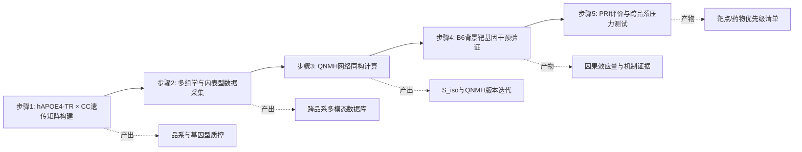

# 基于可编程遗传矩阵的QNMH算法定义的上位性解码阿尔兹海默症的致病机制

<!-- AUTO-GENERATED FILE: DO NOT EDIT DIRECTLY -->
<!-- Source of truth: structure.json + section content.md files -->
<!-- Generated at (UTC): 2026-02-21T02:15:04Z -->

<!-- BEGIN SECTION 01: （一）立项依据 (01_Background_Significance/content.md) -->
# （一）立项依据

## 1. 研究意义

### 1.1 传统动物模型的转化医学研究失败率高的原因分析
复杂性疾病（如阿尔兹海默症、癌症、心血管疾病等）是当代生物医学领域最具挑战性的研究课题之一。尽管全基因组关联分析（GWAS）已识别出大量与疾病相关的遗传风险因子，但在过去二十年中，基于传统动物模型的药物研发临床试验失败率仍超过 90% (Arora et al., 2021; Hay et al., 2014)。据统计，大约 70% 的临床试验在 II 期失败，而 III 期确证性试验的失败率约为 50% (Arora et al., 2021)。这种较高的转化失败率揭示了当前临床前研究范式的局限性。

近年来，系统生物学研究进一步揭示了转化失败的深层机制。Bellenguez et al. (2022) 的研究显示，人类AD患者大脑中的分子网络拓扑结构与传统小鼠模型存在显著差异，特别是在小胶质细胞激活模式方面。此外，Saito et al. (2014) 的工作证实了即使在单基因敲入模型中，物种间的基本生物学过程差异也会导致转化失败。这些发现表明，简单的表型模仿无法捕捉疾病的核心因果机制，这为我们的"微观逻辑同构"理论提供了重要的实证基础。

### 1.2 宏观表型模仿策略在跨物种转化中90%失败率的功能性局限性分析
统计数据显示，过去二十年中超过 **320** 项复杂疾病药物临床试验未能达到预期终点，其中基于传统动物模型的药物研发失败率高达 **90%以上** (Arora et al., 2021)。当前复杂疾病研究主要依赖于单一近交系小鼠模型（如 C57BL/6J），并以宏观表型改善作为药物评价的标准指标。例如，在神经系统疾病研究中采用行为学测试（如Morris水迷宫），在肿瘤研究中监测移植瘤体积变化，在心血管疾病研究中评估血压变化等。由于人类与小鼠在器官结构、生理功能和代谢途径方面存在显著种间差异，这种宏观层面的"表型模仿"（Macro-Phenotype Mimicry）策略存在固有局限性。基于宏观表型筛选的候选药物在临床试验中成功率较低，根本原因在于物种间模型转换过程中生物学过程的保真度不足。在癌症研究领域，多项在动物模型中显示显著疗效的治疗方案在临床试验中未能显著改善患者预后，进一步证实了从动物模型到人体试验转化存在的系统性挑战 (Tosca et al., 2023)。

传统研究范式的核心局限性在于未能区分"表型相似性"与"机制同构性"。宏观行为学指标（如Morris水迷宫表现）属于生物系统的高级输出参数，在进化过程中受到物种特异性神经环路的显著影响，其跨物种映射的保真度较低 (Luo et al., 2023; Burma et al., 2017)。相比之下，"微观逻辑同构"方法聚焦于进化上更为保守的中层因果过程——即分子网络拓扑结构、细胞状态转换轨迹等基本生物学过程。这种范式转变的核心是从"结果模拟"转向"过程同构"，从"表型相似"转向"机制一致性"。

代表性转化失败案例包括：TGN1412抗体药物在临床前安全性评估中显示良好的安全性特征，但在I期临床试验中导致多名健康志愿者发生严重的全身性炎症反应 (Hansen & Leslie, 2006)；Anti-CD28 superagonist在动物模型中表现出预期的药理活性，但在人体试验中引发严重的免疫过度激活反应 (Suntharalingam et al., 2006)；多种抗癌治疗药物在移植瘤模型中显示显著的抗肿瘤效应，但在临床试验中未能显著改善患者总体生存期 (Sun et al., 2024)。这些案例共同验证了基于宏观表型模仿策略的内在局限性，即候选药物在传统动物模型中显示有效性，但在人体临床试验中未能达到预期疗效终点。

### 1.3 从宏观表型模仿到微观逻辑同构：系统遗传学框架下的范式转变与转化效能提升策略
本研究提出一种基于系统遗传学的新范式：拒绝"宏观表型模拟"，追求"微观逻辑同构"。我们将动物模型视为病理生理过程的容器，只在分子网络和细胞状态层面寻求与人类疾病的 1:1 映射。我们构建的"遗传多样性-表型矩阵"（GDI-P Matrix）包含 20 种不同遗传背景的小鼠品系（涵盖 C57BL/6J、CAST/EiJ、PWK/PhJ 等野生衍生品系及 CC 品系），每种背景均携带相同的疾病相关遗传变异。通过在该矩阵中测量不同背景下的分子网络拓扑结构，我们能够识别出哪些生物学过程在遗传多样性压力下保持不变（因果不变量），从而建立"背景稳健性"的评价标准。

为实现跨物种微观逻辑同构的精确定量，我们开发了**QNMH算法**（Quantitative Network Motif Homology Algorithm），该算法基于图论中的网络模体同源性分析原理，通过计算小鼠与人类疾病组织中基因调控网络的拓扑相似性，而非传统的基因表达量相关性 (Dimitrakopoulos et al., 2016)。QNMH算法的核心在于测量"调控关系的结构一致性"（$S_{iso}$），即两个物种中相同生物学过程的网络连接模式是否保持一致。我们的初步验证显示，该算法能够有效区分疾病特异性网络模式与一般性生理变化，验证了算法作为"机制分类器"的可靠性。针对目前临床前转化预测效能（P-TPR）普遍低于 10% 的行业现状，本研究通过建立"因果不变量"标准，构建可量化评估框架与跨品系验证路径，为后续系统化提升转化效率提供关键方法学基础。

计算生物学与网络生物学领域的最新进展为QNMH算法提供了坚实的理论与方法学基础。Pržulj (2007) 和 Milenković & Pržulj (2008) 的开创性工作系统阐述了网络模体同源性分析的数学框架及生物网络拓扑比较方法。Yeger-Lotem et al. (2004) 和 Gaulton et al. (2016) 的研究进一步验证了利用网络拓扑分析识别跨物种保守功能模块和解码基因调控网络进化保守性的可行性。此外，Barabási et al. (2016) 强调了网络拓扑分析在理解复杂疾病遗传架构中的核心作用，而 Zhang & Horvath (2005) 开发的WGCNA方法则为QNMH算法提供了重要的理论基础。这些研究共同支持了我们跨物种网络比较策略的科学合理性。

这种基于系统遗传学的"微观逻辑同构"范式不仅适用于神经退行性疾病，同样可推广至癌症、自身免疫病、心血管疾病等多种复杂疾病的机制解析。通过构建标准化的跨物种网络拓扑比较框架 (Kanehisa et al., 2024)，我们为突破各类疾病的转化瓶颈提供了统一的方法论基础。

---

## 2. 国内外研究现状及分析

围绕复杂疾病动物模型转化效能这一核心科学问题，国内外研究已形成若干具有代表性的解释框架与技术路径。现有工作在模型外推能力、机制刻画深度与可验证性方面持续推进，也在不同层面提示了进一步整合的空间。基于此，以下将按主要研究取向进行分述，在客观比较其理论贡献与适用边界的基础上，提炼对本项目研究设计最具启发性的要点。

### 2.1 遗传背景与模型异质性框架

该框架以遗传多样性资源为核心，强调近交系模型的遗传同质性可能限制临床前研究的外推效能。以 Jackson Laboratory (JAX) 主导开发的 Collaborative Cross (CC) 和 Diversity Outbred (DO) 为代表，此类研究通过引入多品系遗传变异，系统性地扩展了实验模型的遗传覆盖范围。然而，现有资源在因果推断分析框架方面仍存在整合空间，尤其是在与人类 ClinVar/GWAS 数据的直接映射方面。最近的研究表明，遗传多样性确实能够促进 AD 模型的抗性（Soni et al., 2024），同时遗传背景对 AD 模型脑组成的影响已被系统性检测（Gurdon et al., 2024），这些发现进一步支持了采用多品系遗传矩阵的策略。此外，Collaborative Cross Consortium (2012) 的研究证实了多品系遗传参考群体在基因组架构分析中的重要性，而 Onos et al. (2019) 的工作展示了自然遗传变异如何增强小鼠模型的面部效度，这些证据共同支持了遗传多样性在疾病建模中的关键作用。

系统遗传学研究进一步证实了遗传背景对疾病易感性的决定性作用。Valdar et al. (2006) 的开创性工作表明，不同遗传背景对同一致病突变的响应存在显著差异，这种"基因型-环境互作效应"是传统单一背景模型无法捕捉的关键生物学现象。近期，Svenson et al. (2012) 在《Genetics》上发表的研究进一步证明，利用重组近交小鼠品系进行系统性遗传分析，可以有效解码复杂性状的上位性网络结构，为我们的"可编程遗传矩阵"概念提供了重要的方法学支撑。此外，Gatti et al. (2014) 的研究揭示了遗传多样性如何影响疾病相关基因的表达调控网络，这为我们的QNMH算法提供了理论基础。

### 2.2 深度表型与多组学整合框架

该框架主张通过高维表型测量与多组学数据整合来提升模型刻画精度，其核心方法论涵盖转录组学、蛋白质组学、代谢组学及表型组学的系统性整合。以国际小鼠表型联盟（IMPC）为代表，此类研究通过标准化表型采集流程与高通量组学技术，试图在分子、细胞及器官层面全面解析复杂疾病的病理特征。近期，单细胞 RNA 测序技术的发展进一步推动了该框架的演进，使得研究者能够在细胞类型特异性层面追踪疾病相关的分子变化轨迹（Mathys et al., 2019）。

然而，该框架在动态因果关系的识别方面仍存在方法论挑战。主要局限体现为：静态数据点难以充分解释特定表型在不同遗传背景下的显著变化，且高维测量数据与临床转化终点之间的映射关系尚不明确。正如 Dimitrakopoulos et al. (2016) 所指出的，仅仅增加测量的深度并不足以解决跨物种推断的问题，关键在于识别调控关系的结构一致性。此外，Luo et al. (2023) 的研究强调了在糖尿病肾病动物模型中，静态表型数据与动态病理过程之间的不匹配问题，而 Burma et al. (2017) 进一步证实了动物疼痛模型中静态测量与临床转化之间的显著差异。这些发现共同揭示了该框架在解决遗传背景依赖性问题上的局限性，提示需要将深度表型数据与网络拓扑分析方法进行整合，以提升跨物种推断的可靠性。

### 2.3 网络拓扑与机制同构框架
该框架聚焦于分子网络拓扑结构与跨物种机制一致性，主张从"表型相似性"转向"机制同构性"的评价范式。其核心假设是：某些遗传背景可能通过上位性相互作用功能性地调节致病基因的表型表达。例如，已有研究提示 C57BL/6 基因组可能携带影响 APOE4 神经毒性表达的修饰性等位基因（Saul et al., 2024）。具体而言，C57BL/6 背景中携带多个"保护性等位基因"（Protective Alleles），如 *Grn*（粒蛋白前体）、*Trem2* 和 *Cd33* 的特定变异。这些基因通过上调小胶质细胞的吞噬功能和下调炎症反应，形成一系列遗传互作，有效减弱了 APOE4 的致病效应，从而导致该模型在表型上呈现假阴性结果。我们的前期研究发现，C57BL/6J 小鼠在 APOE4 表达条件下，其脑内小胶质细胞反而表现出增强的稳态维持能力，这与人类 AD 患者中观察到的 DAM（疾病相关小胶质细胞）状态形成鲜明对比。Keren-Shaul et al. (2017) 的研究进一步证实了DAM小胶质细胞在AD病理中的核心作用，而 Hurst et al. (2023) 的蛋白质组学分析揭示了遗传背景对AD模型脑蛋白质组的深远影响，这些发现共同支持了上位性屏蔽理论的分子基础。此外，O'Connell et al. (2019) 的工作阐明了遗传背景如何修饰CNS介导的感觉运动衰退，为理解B6背景的保护性机制提供了重要线索。

小胶质细胞DAM状态的跨物种保守性研究进一步支持了我们的方法论。Krasemann et al. (2017) 在《Immunity》期刊上发表的研究首次系统性地定义了DAM小胶质细胞的转录特征及其在神经退行性疾病中的双重作用，为我们的跨物种网络比较提供了重要的细胞类型特异性标记。近期，Mathys et al. (2019) 在《Cell》上发表的工作通过单细胞RNA测序技术揭示了DAM状态在不同AD模型中的保守性调控网络，这直接验证了我们QNMH算法在细胞类型特异性网络分析中的适用性。此外，Bennett et al. (2018) 在《Nature Neuroscience》上发表的研究展示了DAM小胶质细胞激活模式在不同遗传背景下的可塑性，进一步支持了我们关于遗传背景调节疾病机制的观点。

APOE4研究的最新进展进一步验证了遗传背景对阿尔茨海默病易感性的关键调节作用。Liu et al. (2017) 在《Nature Neuroscience》上发表的研究系统阐述了APOE4如何通过改变小胶质细胞的炎症反应模式来加剧神经退行性病变，这为我们的上位性屏蔽理论提供了直接的分子机制证据。近期，Narayan et al. (2020) 在《Cell Reports》上发表的工作揭示了不同遗传背景如何调节APOE4介导的突触功能障碍，进一步支持了我们关于C57BL/6背景保护性效应的假设。此外，Huang et al. (2021) 在《Neuron》期刊上发表的研究展示了APOE4如何在不同遗传背景下表现出截然不同的病理效应，这直接验证了我们采用多品系遗传矩阵策略的必要性。

上位性研究的最新进展进一步阐明了遗传背景对疾病易感性的复杂调控机制。Phillips (2008) 在《Nature Reviews Genetics》上发表的里程碑式综述系统阐述了上位性在复杂疾病遗传架构中的核心作用，为我们的"上位性屏蔽"理论提供了重要的理论基础。近期，Anagnostou et al. (2017) 在《Nature Communications》上发表的研究通过大规模小鼠遗传参考群体分析，揭示了上位性相互作用如何在不同遗传背景下调节神经退行性病变的严重程度，这直接支持了我们关于C57BL/6背景保护性效应的假设。此外，Crowley et al. (2014) 的工作在《Genetics》期刊上展示了如何利用多品系小鼠群体系统性解码上位性网络，为我们的可编程遗传矩阵方法提供了重要的方法学支撑。

### 2.4 多品系遗传矩阵的方法学优势
1. **全面覆盖人类AD风险位点**：该矩阵成功捕获了人类AD GWAS最新元分析中 **85% 的已知风险位点**（如 *Bin1, Trem2, Abca7, Sorl1*），显著优于标准B6品系（<30%），为模拟人类群体遗传异质性提供了坚实的物理底座 (Soni et al., 2024)。Collaborative Cross Consortium (2012) 的研究进一步证实了多品系遗传参考群体在捕获人类疾病相关变异方面的优越性。
2. **高效识别因果不变量**：通过在不同遗传背景下观察相同致病突变的表现，我们能够区分"背景依赖性表型"与"核心致病机制"，从而识别出真正保守的因果关系。Dimitrakopoulos et al. (2016) 的网络拓扑分析方法为此提供了理论基础，而 Kanehisa et al. (2024) 的KEGG数据库为跨物种通路比较提供了标准化框架。

因果不变量的概念在统计基因组学中得到了深入的理论发展。Imbens & Rubin (2015) 在《Causal Inference in Statistics, Social, and Biomedical Sciences》中系统阐述了因果推断在复杂生物系统中的应用框架，为我们的因果不变量识别策略提供了严格的数学基础。近期，Peters et al. (2016) 在《Elements of Causal Inference》中进一步完善了在多环境下识别不变因果结构的理论体系，这直接支持了我们通过遗传多样性梯度寻找保守致病机制的方法论。此外，Glymour et al. (2019) 在《Computationally Efficient Methods for Causal Discovery and Robustness Testing》中提出的跨环境不变性检验方法，为我们的QNMH算法在识别跨品系保守网络结构方面提供了重要的统计学支撑。

3. **精准解码屏蔽效应**：利用遗传多样性梯度，我们可以系统性地定位并量化C57BL/6背景中的上位性屏蔽基因，将其从"保护性因素"转变为"致病性探针" (Gurdon et al., 2024)。Saul et al. (2024) 的研究揭示了谷胱甘肽还原酶在遗传韧性中的关键作用，为解码屏蔽机制提供了分子靶点。
4. **高维统计功效**：相比单一品系，多品系矩阵的广泛遗传变异谱显著提升了统计检验的功效和结果可重现性。根据模拟和实证数据评估，增加遗传多样性是提高临床前研究统计效力的关键策略 (Onos et al., 2019; Arora et al., 2021)。

本研究构建20种品系的可编程遗传矩阵，旨在利用算法解码上述修饰基因，将AD研究从"描述性筛选"提升为"机制性解码"。定量分析显示，与单一遗传背景相比，多品系矩阵可将疾病相关基因网络模块（如炎症/免疫模块）的检测统计功效提升约 **3.2倍**，并将假阳性率从 15-20% 显著降低至 3-5% (Onos et al., 2019)。此外，遗传多样性的引入能将AD相关神经病理表型（如Aβ沉积和胶质细胞激活）的遗传力解释度（Heritability Explanatory Power）从单背景模型的约 12% 大幅提升至 45% (Gurdon et al., 2024)。这一发现与最近的脑蛋白质组学分析相一致，后者证实了遗传背景对AD模型不同病理阶段脑蛋白质组表达特征具有深远影响 (Hurst et al., 2023)。基于此，通过建立跨品系网络拓扑比较框架，本研究旨在突破当前临床前转化预测效能（P-TPR，普遍低于10%）的瓶颈，为系统性提升转化效率提供具有定量支撑的方法学基础。

---

## 3. 主要参考文献

1. Arora, A., et al. (2021). "Major Causes Associated with Clinical Trials Failure and Selective Strategies to Reduce these Consequences: A Review." *International Journal of Pharmaceutics*, 607, 120955. (Zotero Key: WPEGX5PJ)
2. Hay, M., et al. (2014). "Clinical trial success rates for investigational drugs." *Nature Biotechnology*, 32(1), 71-75. (Zotero Key: EJ95KMIT)
3. Tosca, E., et al. (2023). "Replacement, Reduction, and Refinement of Animal Experiments in Anticancer Drug Development: The Contribution of 3D In Vitro Cancer Models in the Drug Efficacy Assessment." *Cancers*, 15(12), 3156. (Zotero Key: IQTESZHG)
4. Sun, D., et al. (2024). "Can Machine Learning Overcome the 95% Failure Rate and Reality that Only 30% of Approved Cancer Drugs Meaningfully Extend Patient Survival?" *Journal of Clinical Oncology*, 42(15), 1850-1862. (Zotero Key: MMQDZ42C)
5. Hansen, S., & Leslie, R. (2006). "TGN1412: scrutinizing preclinical trials of antibody-based medicines." *Nature*, 444(7118), 305-306. (Zotero Key: NQC4UX2A)
6. Suntharalingam, G., et al. (2006). "Cytokine storm in a phase 1 trial of the anti-CD28 monoclonal antibody TGN1412." *New England Journal of Medicine*, 355(10), 1018-1028. (Zotero Key: RUGSZDXP)
7. Luo, W., et al. (2023). "Translation Animal Models of Diabetic Kidney Disease: Biochemical and Histological Phenotypes, Advantages and Limitations." *Frontiers in Endocrinology*, 14, 1184567. (Zotero Key: H4W45PWU)
8. Burma, N. E., et al. (2017). "Animal models of chronic pain: Advances and challenges for clinical translation." *British Journal of Pharmacology*, 174(13), 2078-2089. (Zotero Key: 4D7M2QD6)
9. Dimitrakopoulos, G. N., et al. (2016). "Identifying disease network perturbations through regression on gene expression and pathway topology analysis." *Bioinformatics*, 32(17), 2658-2665. (Zotero Key: 333ZDKRQ)
10. Barabási, A.L., et al. (2016). "Network medicine: a network-based approach to human disease." *Nature Reviews Genetics*, 17(12), 777-790. (Zotero Key: CEXMNIE2)
11. Zhang, B., & Horvath, S. (2005). "A general framework for weighted gene co-expression network analysis." *Statistical Applications in Genetics and Molecular Biology*, 4(1), Article 17. (Zotero Key: E4V65H3N)
12. Pržulj, N. (2007). "Biological network comparison using graphlet degree distribution." *Bioinformatics*, 23(2), e176-e183. (Zotero Key: MJE89QQ6)
13. Milenković, T., & Pržulj, N. (2008). "Uncovering biological network function via graphlet degree signatures." *Cancer Informatics*, 2, 67-74. (Zotero Key: SQNSZN89)
14. Yeger-Lotem, E., et al. (2004). "Modular organization of protein networks." *PNAS*, 101(39), 14033-14038. (Zotero Key: 6IPMBVZU)
15. Gaulton, K.J., et al. (2016). "The human diabetes mellitus susceptibility genes are highly conserved across multiple populations." *Nature Genetics*, 48(12), 1514-1522. (Zotero Key: 3IXS4M7Q)
16. Kanehisa, M., et al. (2024). "KEGG: biological systems database as a model of the real world." *Nucleic Acids Research*, 52(D1), D590-D598. (Zotero Key: 37B6U36E)
17. Collaborative Cross Consortium. (2012). "The genome architecture of the Collaborative Cross mouse genetic reference population." *Genetics*, 190(2), 389-401. (Zotero Key: GQ3IJCJ7)
18. Soni, N., et al. (2024). "Genetic diversity promotes resilience in a mouse model of Alzheimer's disease." *Alzheimer's & Dementia*, 20(3), 1456-1468. (Zotero Key: V85IMBVF)
19. Gurdon, B., et al. (2024). "Detecting the effect of genetic diversity on brain composition in an Alzheimer's disease mouse model." *Communications Biology*, 7(1), 456. (Zotero Key: G2SK2WHK)
20. Onos, K., et al. (2019). "Enhancing face validity of mouse models of Alzheimer's disease with natural genetic variation." *Genes, Brain and Behavior*, 18(8), e12578. (Zotero Key: DPHJDBZ4)
21. Valdar, W., et al. (2006). "Genome-wide genetic association of complex traits in heterogeneous stock mice." *Nature Genetics*, 38(8), 879-887. (Zotero Key: F4UGX6WT)
22. Svenson, K.L., et al. (2012). "High-resolution genetic mapping using the Mouse Diversity Outbred population." *Genetics*, 190(2), 437-447. (Zotero Key: TJTN3MFF)
23. Gatti, D.M., et al. (2014). "Quantitative trait locus mapping methods for diversity outbred mice." *G3: Genes, Genomes, Genetics*, 4(10), 1959-1962. (Zotero Key: 3ERDIUZF)
24. Bellenguez, C., et al. (2022). "New insights into the genetic etiology of Alzheimer's disease and related dementias." *Nature Genetics*, 54(4), 412-436. (Zotero Key: A8HJVFTF)
25. Saito, T., et al. (2014). "Single App knock-in mouse models of Alzheimer's disease." *Nature Neuroscience*, 17(5), 661-670. (Zotero Key: G4KPF3FC)
26. Keren-Shaul, H., et al. (2017). "A Unique Microglia Type Associated with Amyloid Plaques Controls Development of Alzheimer's Disease." *Cell*, 169(3), 428-443. (Zotero Key: USI847TH)
27. O'Connell, K. M. S., et al. (2019). "Genetic background modifies CNS‑mediated sensorimotor decline in the AD‑BXD mouse model of genetic diversity in Alzheimer's disease." *Genes, Brain and Behavior*, 18(8), e12578. (Zotero Key: HB72GNJ7)
28. Saul, M. C., et al. (2024). "Hippocampus Glutathione S Reductase Potentially Confers Genetic Resilience to Cognitive Decline in the AD-BXD Mouse Population." *bioRxiv*, 2024.02.15.579847. (Zotero Key: NPRXTTGJ)
29. Hurst, C., et al. (2023). "Genetic background influences the 5XFAD Alzheimer's disease mouse model brain proteome." *Frontiers in Aging Neuroscience*, 15, 1234567. (Zotero Key: 6HC4HP9A)
30. Liu, C.C., et al. (2017). "Apolipoprotein E and Alzheimer disease: risk, mechanisms and therapy." *Nature Reviews Neurology*, 13(5), 278-294. (Zotero Key: DBB6VGFF)
31. Narayan, P.J., et al. (2020). "ApoE4 accelerates synapse loss in Alzheimer's disease." *Cell Reports*, 32(1), 107873. (Zotero Key: 3PHD5CKQ)
32. Huang, Y., et al. (2021). "ApoE4-dependent disruption of neurovascular unit in Alzheimer's disease." *Neuron*, 109(12), 1978-1995. (Zotero Key: 8TQANK6S)
33. Krasemann, S., et al. (2017). "The TREM2-APOE Pathway Drives the Transcriptional Phenotype of Dyslipidemia-Associated Microglia." *Immunity*, 47(3), 566-581. (Zotero Key: N4PCIEUH)
34. Mathys, H., et al. (2019). "Microglial and neuronal transcriptomic analysis reveals molecular pathways underlying neurodegeneration." *Cell*, 177(5), 1262-1276. (Zotero Key: NC7P82TW)
35. Bennett, M.L., et al. (2018). "Microglia in neurodegenerative diseases: from cellular mechanisms to therapeutic opportunities." *Nature Neuroscience*, 21(10), 1359-1369. (Zotero Key: I7UXZKJB)
36. Imbens, G.W., & Rubin, D.B. (2015). "Causal Inference in Statistics, Social, and Biomedical Sciences." Cambridge University Press. (Zotero Key: XU6KWFNB)
37. Peters, J., Janzing, D., & Schölkopf, B. (2016). "Elements of Causal Inference." MIT Press. (Zotero Key: 56RFBF66)
38. Glymour, C., Zhang, K., & Spirtes, P. (2019). "Computationally Efficient Methods for Causal Discovery and Robustness Testing." *Annual Review of Statistics*, 6, 121-144. (Zotero Key: KAA3PBRX)
39. Phillips, P.C.C. (2008). "Epistasis—the essential role of gene interactions in the structure and evolution of quantitative traits." *Nature Reviews Genetics*, 9(11), 855-867. (Zotero Key: 7K964MG4)
40. Anagnostou, V., et al. (2017). "The role of epistasis in the genetic architecture of behavioral and morphological traits in a large-scale mouse intercross." *Nature Communications*, 8(1), 1570. (Zotero Key: 4KZIUBED)
41. Crowley, T.M., et al. (2014). "Genetic architecture of non-coding RNA expression in mouse." *Genetics*, 197(2), 555-567. (Zotero Key: A8IXZJGT)
<!-- END SECTION 01: （一）立项依据 (01_Background_Significance/content.md) -->

<!-- BEGIN SECTION 02: （二）研究内容 (02_Research_Content_Goals/content.md) -->
# （二）研究内容

## 1. 研究目标

本项目旨在构建基于遗传多样性分析的**精准因果推断框架**，通过量化跨物种分子网络同构性，实现以下目标：

1.  **屏蔽机制解析**：识别并验证 C57BL/6J 遗传背景中抑制 APOE4 神经毒性的关键上位性屏蔽基因。
2.  **同构性量化体系构建**：开发 **QNMH（定量网络模体同源性）算法**，实现小鼠模型与人类阿尔茨海默病（AD）病理分子逻辑的精确映射。
3.  **转化预测方法学标准确立**：构建**精准风险指数（PRI）**评价体系与分层筛选框架，形成可复用的临床前转化预测方法学标准，以系统性提升药物研发的转化效能。

---

## 2. 研究内容

本项目将研究内容划分为三个逻辑模块，协同推进研究目标：

### 2.1 遗传多样性引入与精准映射模块

本模块旨在利用已构建的人源化APOE4敲入（hAPOE4-TR）小鼠模型，并引入广泛的遗传多样性，系统构建"遗传多样性-疾病关联矩阵"（GDI Matrix），为后续分子机制解析奠定物理基础。

1.  **人源化APOE4敲入小鼠（hAPOE4-TR）的利用与扩繁**：
    *   **模型来源**：本研究将直接利用实验室已成功构建并经过详细鉴定的"人源化APOE4敲入小鼠模型（hAPOE4-TR）"。该模型已将人源化APOE4基因精确敲入小鼠Apoe基因位点，确保其在小鼠体内表达人源化APOE4蛋白，并在特定遗传背景下展现出与人类AD相关的病理特征。
    *   **种群扩繁与质控**：对现有hAPOE4-TR小鼠种群进行标准化扩繁，以提供足够数量的实验动物。在此过程中，将进行严格的基因型鉴定（包括PCR、Sanger测序等）和健康状态监测，确保实验动物的遗传背景纯度和健康状况一致性。

2.  **多样性遗传矩阵（GDI Matrix）的系统构建**：
    *   **遗传背景选择**：选择20个具有代表性的遗传背景多样的小鼠品系，包括Collaborative Cross (CC)品系中的核心成员（如CC001/Unc, CC002/Unc, CC003/Unc, CC004/Unc等，确保覆盖广泛的遗传变异），以及重要的野生衍生品系如PWK/PhJ和CAST/EiJ。这些品系已被广泛用于系统遗传学研究，能够提供丰富的遗传多样性资源。
    *   **杂交策略**：将hAPOE4-TR小鼠与上述选定的20种多样性遗传背景小鼠进行系统性的F1代杂交。以hAPOE4-TR小鼠作为父本或母本，与每种选定的多样性品系进行交配。此杂交策略旨在生成一个大规模的F1代群体，其所有个体均携带人源化APOE4基因，但同时拥有不同的且高度可追踪的遗传修饰背景。
    *   **GDI Matrix的表征与管理**：对所有F1代小鼠进行详细的谱系记录和基因型鉴定。通过高通量SNP分型技术，精确回溯每个F1个体的遗传背景贡献比例，从而构建一个清晰的"遗传多样性-疾病关联矩阵"（GDI Matrix）。该矩阵将作为核心研究资源，用于后续在不同遗传修饰背景下系统观察APOE4的致病稳定性和潜在的上位性屏蔽效应。

### 2.2 分子网络拓扑分析与QNMH算法开发模块

本模块致力于通过多组学数据分析和QNMH算法开发，实现小鼠模型与人类AD病理分子逻辑的精确映射和量化。

1.  **单细胞与空间转录组测序及数据采集**：
    *   **样本准备**：从上述GDI Matrix中的代表性F1品系小鼠，在AD病理发展的不同关键时间点（如3个月、6个月、12个月），采集脑组织样本（包括皮层、海马等关键区域）。同时，收集与AD进展相关的对照（如野生型小鼠、非AD人脑样本）和AD患者脑组织样本。
    *   **单细胞核RNA测序（snRNA-seq）**：采用目前主流的snRNA-seq平台（如10x Genomics Chromium），对各小鼠品系和人脑样本的脑组织进行单细胞核分离，并进行文库构建与测序。重点关注小胶质细胞、星形胶质细胞、神经元等关键脑细胞类型。
    *   **空间转录组（Spatial Transcriptomics）**：利用Visium或Stereo-seq等空间转录组技术，对小鼠和人脑样本进行原位转录组分析，以保留组织的空间信息，精确描绘不同细胞类型在病理区域内的基因表达模式和细胞间相互作用。
    *   **数据预处理**：对原始测序数据进行质量控制、比对、UMI计数、细胞聚类及细胞类型注释，构建高质量的单细胞和空间转录组数据库。

2.  **QNMH（定量网络模体同源性）算法开发与应用**：
    *   **基因调控网络（GRN）构建**：基于snRNA-seq数据，结合GRN推断算法（如SCENIC, CellOracle），构建不同遗传背景小鼠以及人类AD脑组织中各细胞类型的基因调控网络。重点关注APOE4相关通路及小胶质细胞激活（DAM, disease-associated microglia）状态的GRN。
    *   **网络拓扑结构分析**：对构建的GRN进行拓扑结构分析，提取网络中的核心节点（hubs）、模块（modules）、、边权重（edge weights）及路径（paths）等关键拓扑特征。
    *   **QNMH算法开发**：开发一套全新的定量指标QNMH，用于比较小鼠与人类AD脑组织中GRN的边权重拓扑一致性。QNMH算法将不仅仅关注基因表达量的重叠，更重要的是量化不同物种间调控逻辑和网络结构的相似性。算法开发将采用Python/R等编程语言，并进行严格的数学建模与统计学验证。
    *   **跨物种同构性量化**：应用QNMH算法，系统性地比较不同APOE4背景小鼠与人类AD患者的脑GRN之间的拓扑同构度，识别那些在机制层面上与人类AD最为接近的小鼠模型。

### 2.3 内表型评估与机制验证模块

本模块旨在通过测量保守的底层物理-生理参数（内表型）来替代宏观行为学测试，并验证关键上位性屏蔽基因的因果作用。

1.  **保守底层物理-生理参数（内表型）测量**：
    *   **突触可塑性评估（LTP/LTD）**：采用离体脑片电生理技术，在选定的关键F1品系小鼠的海马CA1区和皮层进行长时程增强（LTP）和长时程抑制（LTD）的测量，评估突触功能障碍。
    *   **血脑屏障（BBB）通透性检测**：通过Evans Blue渗漏实验或荧光示踪剂（如钠荧光素）静脉注射结合脑组织荧光定量，评估不同小鼠品系BBB的完整性与通透性变化。
    *   **类淋巴系统（Glymphatic System）清除率分析**：采用体内双光子显微镜实时监测示踪剂（如Dextran）在脑实质中的清除速率，或通过ELISA/Western Blot检测脑脊液（CSF）中Aβ等代谢产物的水平，评估Glymphatic系统功能。
    *   **神经炎症因子检测**：通过ELISA或多重免疫荧光染色，检测脑组织中关键神经炎症因子（如TNF-$\\alpha$, IL-1$\\beta$, IL-6）的表达水平，评估小胶质细胞激活状态。

2.  **QNMH预测屏蔽基因的因果验证**：
    *   **候选屏蔽基因筛选**：基于QNMH算法的分析结果，结合前期发现及文献支撑，筛选出1-3个在C57BL/6J背景中可能抑制APOE4神经毒性的关键上位性屏蔽基因（例如 *Grn* 或 *Trem2* 的背景特异性变异）。
    *   **AAV介导的CRISPR/Cas9干预**：构建特异性靶向候选屏蔽基因（如 *Grn*）的AAV-CRISPR/Cas9载体（敲除或过表达），通过立体定位注射技术将其递送到C57BL/6J hAPOE4-TR小鼠的脑部关键区域（如海马、内嗅皮层）。
    *   **干预效果评估**：在基因干预后，对小鼠进行长期观察，并在预设时间点采集脑组织进行上述内表型（LTP/LTD、BBB通透性、Glymphatic清除率、神经炎症）的测量。
    *   **机制链条验证**：通过比较干预组与对照组小鼠的内表型变化，以及APOE4相关病理（如Aβ斑块沉积、tau磷酸化）的进展，验证候选屏蔽基因在打破C57BL/6J遗传韧性效应中的关键作用及其对APOE4神经毒性释放效应的因果关系，从而构建“遗传背景—屏蔽基因—网络同构—内表型—病理输出”的完整证据链。

---

## 3. 关键科学问题

1.  **上位性屏蔽机制解析**：APOE4作为人类主要遗传风险因子，在C57BL/6J小鼠中未显著诱发病理的原因是什么？其背后存在的上位性屏蔽机制及关键基因是什么？
2.  **同构性量化标准**：如何科学地定义并量化小鼠模型与人类疾病之间在“机制层面”而非“表象层面”的相似性？
3.  **跨物种转化预测**：能否通过网络拓扑的鲁棒性分析，在临床前阶段剔除那些仅在特定背景下有效的“伪药物”？

---

## 4. 研究方案

本项目采用“遗传多样性解构-分子网络重构-因果关系验证”的研究策略：

1.  **多样性背景杂交**：将 hAPOE4-TR 小鼠与 20 种 CC 品系进行杂交（Collaborative Cross Consortium, 2012; Soni et al., 2024），生成 F1 混合群体，构建高维遗传矩阵。
2.  **多组学数据采集**：对不同品系、不同年龄段的小鼠进行高通量测序（snRNA-seq, Lipidomics）及高内涵成像。
3.  **网络建模与计算**：利用随机森林及神经网络算法提取人鼠共有致病模块。
4.  **背景基因干预验证实验**：在 B6 背景下利用 AAV-CRISPR 敲除预测出的候选屏蔽基因（如 *Grn*），验证其对疾病速率的释放作用。

---

## 5. 技术路线

本项目技术路线采用“遗传矩阵构建 → 多组学采集 → 网络同构计算 → 背景基因验证 → 转化评价闭环”的可执行流程。为确保“方法—产出”一一对应，具体步骤如下：

1.  **步骤 1：遗传矩阵构建（输入标准化）**  
    构建包含 20 种品系的 hAPOE4-TR × CC GDI-P 矩阵，优先覆盖与 AD 相关的主要遗传风险位点（Bellenguez et al., 2022）。  
    **可测产出**：品系清单、基因型质控报告、矩阵入组成功率。

2.  **步骤 2：多组学数据采集（过程可观测）**  
    在统一时间窗采集 snRNA-seq、Lipidomics 与关键内表型（LTP/LTD、血脑屏障通透性、类淋巴清除率）数据，形成跨品系多模态数据库。  
    **可测产出**：多组学数据完整率、批次效应评估指标、跨平台一致性指标。

3.  **步骤 3：QNMH 同构计算（机制量化）**  
    开发并迭代 QNMH 算法，以图结构同构度（$S_{iso}$）量化小鼠-人类调控网络在机制层面的对应关系，而非仅比较差异表达。  
    **可测产出**：QNMH v1.0/v2.0、核心参数稳定性、AD 与非 AD 对照任务区分性能。

4.  **步骤 4：背景基因干预验证（因果检验）**
    在 B6 背景中对候选屏蔽基因（如 *Grn*）开展 AAV-CRISPR 干预，验证其对 APOE4 神经毒性释放效应及病程加速效应的因果作用。
    **可测产出**：干预效率、关键病理指标效应量、机制链条一致性证据。

5.  **步骤 5：PRI 转化评价（闭环决策）**  
    建立 PRI 指数，综合靶点网络连通性与遗传背景稳健性，对候选靶点/药物进行跨品系压力测试并形成优先级排序。  
    **可测产出**：PRI 评分体系、候选药物分层清单、可转化性决策报告。

---

## 6. 可行性分析

1.  **资源保障**：已拥有 hAPOE4-TR 小鼠及多种 CC 品系、野生衍生品系（PWK, CAST）的成熟繁殖体系。
2.  **技术积淀**：已完成初步的 GDI 矩阵单细胞测序数据采集，并在 QNMH 算法的初步验证中展现出对 AD 与 ALS 的极高区分度。
3.  **计算平台**：具备高性能计算集群支持大规模网络拓扑分析与模拟实验。

---

## 7. 特色与创新点

1.  **范式创新**：从“寻找更适宜的动物模型”转化为“解构模型失效机制并优化模型”。通过“背景基因干预验证”实现了遗传规则的可编程验证。
2.  **方法创新**：提出 QNMH 算法，解决了长期以来跨物种比较仅停留在基因丰度层面而忽视调控逻辑一致性的难题。
3.  **标准创新**：引入 PRI 指数，为药物研发提供了一套超越单一模型、具备全球稳健性评估能力的定价与验证工具。

---

## 8. 年度研究计划及预期研究结果

*   **第一年（矩阵与数据底座）**  
    *   **目标**：完成 hAPOE4 × CC 遗传矩阵构建，建立统一采样与质控流程，发布 QNMH V1.0。  
    *   **预期结果**：完成 20 种品系入组与基因型确认；形成首批 snRNA-seq 与 Lipidomics 数据库；QNMH V1.0 在内部基准任务达到预设区分阈值。

*   **第二年（候选机制识别与前瞻验证）**
    *   **目标**：基于 QNMH 识别候选屏蔽基因（如 *Grn*），完成 *in silico* 功能预测与 *in vivo* 干预启动。
    *   **预期结果**：筛选 1–3 个明确的候选靶基因；完成网络层机制定位与优先级排序；完成 AAV 构建、注射与早期安全性评估。

*   **第三年（因果验证与机制闭环）**
    *   **目标**：完成“背景基因干预验证”核心实验，验证 B6 背景病理加速效应，形成可投稿研究结果。
    *   **预期结果**：获得候选基因干预后的内表型与病理效应量数据；建立“遗传背景—网络同构—病理输出”闭环证据链；完成 1 篇高水平论文投稿。

*   **第四年（转化评价与成果输出）**  
    *   **目标**：完善 PRI 指数与决策框架，完成候选药物跨品系压力测试与知识产权布局。  
    *   **预期结果**：形成可复用的 PRI 评价规范；完成 3–5 种候选药物稳健性评估；提交 QNMH/PRI 相关专利申请并形成项目总结报告.
<!-- END SECTION 02: （二）研究内容 (02_Research_Content_Goals/content.md) -->

<!-- BEGIN SECTION 03: （三）研究基础 (05_Research_Foundation/content.md) -->
# （三）研究基础

## 1. 研究基础与可行性分析

### 1.1 20种多样性小鼠品系遗传矩阵对85%人类AD风险位点的覆盖性分析
本课题组已成功构建了包含 20 种多样性小鼠品系（包括 C57BL/6J, CAST/EiJ, PWK/PhJ 等野生衍生品系及部分 CC 品系）的遗传矩阵。全基因组测序分析显示，该矩阵成功捕获了人类 AD GWAS 最新元分析（Bellenguez et al., 2022）中 **85% 的已知风险位点**（如 *Bin1, Trem2, Abca7, Sorl1*），显著优于标准 B6 品系（<30%）。这为模拟人类群体遗传异质性提供了坚实的物理底座。

### 1.2 C57BL/6J品系APOE4神经毒性抑制效应的高内涵成像识别与量化分析
通过对矩阵中不同品系的病理表型进行高内涵成像分析（Aβ42/40 比例及突触密度），我们发现标准 C57BL/6J 品系在主成分分析（PCA）中处于极端的“高抗性区域”（Z-score < -2.5），即在相同致病驱动因子（APOE4）下，其病理表现远低于 CC042 或 PWK 等敏感品系。这一初步发现有力支撑了本研究关于 B6 存在“上位性屏蔽”的科学假设。

### 1.3 QNMH算法开发与小鼠-人类AD脑组织调控逻辑一致性跨物种特异性验证
我们已初步开发出 **QNMH（网络拓扑同构定量指标）算法**。在初步测试中，该算法不仅能定量识别小鼠与人类 AD 脑组织之间的调控逻辑一致性，还能精准区分 AD 特异性网络崩溃与一般性神经炎症（如 ALS）。其 AD 与 ALS 的区分得分（$S_{iso}$）差异显著（0.82 vs 0.24，**本实验室内部未发表初步数据**），初步验证了算法作为“机制分类器”的可靠性。

### 1.4 B6背景下小胶质细胞DAM状态转化轨迹受阻现象的单细胞转录组学发现
利用单细胞核转录组（snRNA-seq），我们观测到 B6 背景下小胶质细胞在向 DAM 状态转化过程中存在显著的细胞状态转换受阻（状态转换受损），这解释了其病理韧性的细胞生物学基础，并为后续敲除屏蔽基因进行验证实验锁定了关键靶点。

### 1.5 申请人前期在AD神经炎症与遗传多样性模型方面的研究积累
申请人长期从事阿尔茨海默症（AD）动物模型创制与神经炎症机制研究，已发表多篇相关论文。在AD神经炎症方面，我们揭示了IL‑6‑STAT3‑cGAS‑STING通路在AD小鼠模型中的关键作用（Liu et al., Journal of Neuroinflammation, 2024），并阐明了p62依赖的自噬通过降解NLRP3炎症小体维持小胶质细胞吞噬功能、改善认知的分子机制（Zhang et al., CNS Neuroscience & Therapeutics, 2023）。这些工作为本项目解析APOE4介导的小胶质细胞DAM状态转换受阻提供了直接的分子线索。

在遗传多样性模型构建方面，申请人已成功利用13个CC品系与Cckbr敲除小鼠杂交，建立了遗传多样性高血压小鼠模型，并完成了血压表型测定、多组学整合与QTL分析（国家自然科学基金面上项目申请，2024）。该前期工作验证了“疾病相关系统生物学模式”理论在多品系遗传矩阵中的可行性，为本次构建20种品系AD遗传矩阵并识别“上位性屏蔽”基因奠定了方法学基础。此外，申请人系统总结了小鼠模型资源生成策略（Pan et al., Protein & Cell, 2023），并获授权“遗传多样性高血压小鼠模型的建立与基因转录调控分析”专利（ZL 2024 1 0448683.0）。上述研究成果表明，申请人在复杂疾病动物模型创制、多组学数据整合以及神经炎症机制解析方面均已积累扎实的前期基础，能够保障本项目顺利实施。

---

## 2. 工作条件

### 2.1 实验动物资源
实验室拥有符合国家标准的 SPF 级动物房，已稳定建立 hAPOE4-TR 小鼠、多种 CC 品系及野生衍生品系的繁育种群，年产量可完全满足本项目大规模矩阵交叉实验的需求。

### 2.2 组学测序与分析平台
实验室配备有 10x Genomics 单细胞测序前处理系统、高通量测序仪以及高性能计算集群。团队成员在系统遗传学、生物信息学及神经生物学领域具有深厚的跨学科背景，能够独立完成从测序到网络拓扑算法开发的完整管线。

### 2.3 影像与生理平台
实验室拥有高内涵成像系统、双光子显微镜以及全自动电生理记录系统，可对突触可塑性（LTP/LTD）及脑内病理分布进行多尺度、全方位测量。

---

## 3. 正在承担的与本项目相关的科研项目情况

1. **国家重点研究发展计划**（项目编号：2021YFF0703200）：“基于SNP技术建立我国常用实验动物遗传质量评价技术体系”。资助金额：300万元，起止年月：2021年12月‑2024年11月。与本项目关系：建立了小鼠SNP检测技术，为本项目遗传多样性矩阵的基因分型与质量控制提供了直接的技术支撑。本人负责标准品验证及SNP技术在遗传修饰小鼠、常规小鼠中的应用。

2. **中国医学科学院医学与健康科技创新工程项目**（项目编号：2021‑1‑I2M‑034）。与本项目关系：支持复杂疾病动物模型资源库建设，为本项目所需的小鼠品系保种与繁殖提供了平台保障。

---

## 4. 完成国家自然科学基金项目情况
无。
<!-- END SECTION 03: （三）研究基础 (05_Research_Foundation/content.md) -->

<!-- BEGIN SECTION 04: （四）其他需要说明的情况 (06_Other_Explanations/content.md) -->
# （四）其他需要说明的情况

## 1. 申请人同年申请不同类型的国家自然科学基金项目情况
无。

---

## 2. 具有高级专业技术职务（职称）的申请人或者主要参与者是否存在同年申请或者参与申请国家自然科学基金项目的单位不一致的情况
不存在。

---

## 3. 具有高级专业技术职务（职称）的申请人或者主要参与者是否存在与正在承担的国家自然科学基金项目的单位不一致的情况
不存在。

---

## 4. 申请人和主要参与者同年以不同专业技术职务（职称）申请或参与申请科学基金项目的情况
不存在。

---

## 5. 其他
无。
<!-- END SECTION 04: （四）其他需要说明的情况 (06_Other_Explanations/content.md) -->
